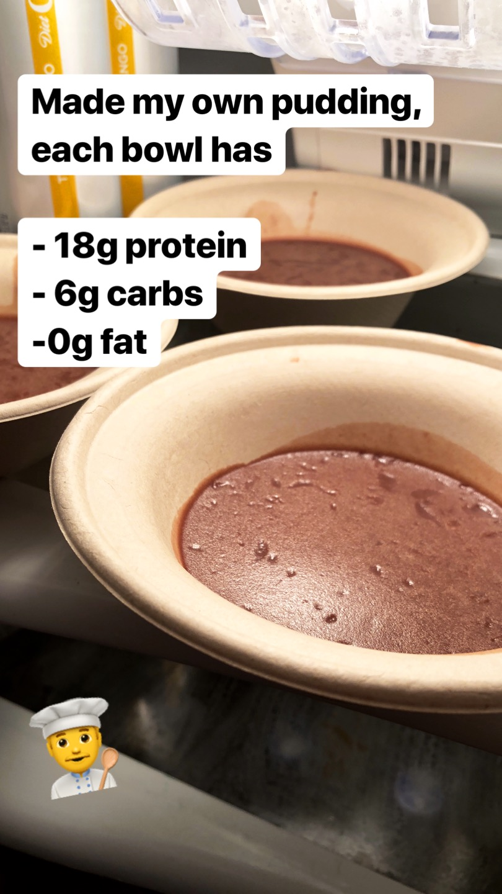
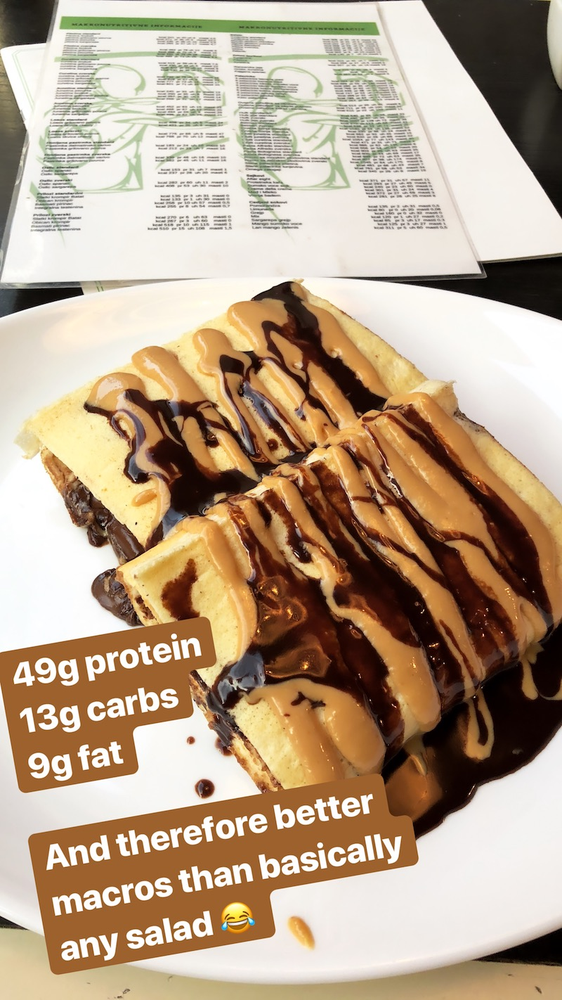

# 0kcal food

## Project status:

This is a super early Work in Progress, I'm just getting started experimenting with 0 calorie food. Right now, there are only 2 recipes available, both of which are not actually 0kcal. Over the next few weeks I'll add more information up here. Long term, this could be a beautiful, open source website with a list of available recipes.

## Background

### 0kcal products

Over the last 10 years, 0 calorie soft-drinks became more and more popular. It started with a basic 0kcal version of Coca Cola, and now slowly expanded to more and more drinks, like 0kcal versions of Fanta, Sprite, VitaminWater and 5 different flavors of Coke.

### Flavors

The fitness supplement industry started out with Whey protein powder for the basic flavors of chocolate, strawberry and vanilla. Nowadays there are literally hundreds of flavors available, from popcorn, to piña colada to fruit loops. All those flavors are artificial and come with basically no fat and no carbs. 

The same happened for BCAA powder, you have the same flavors available, but without the protein, so depending on how you calculate it, it has basically almost no calories.

### Fitness diets

If you're in a normal body building routine, you usually aim for high protein intake and low amounts of fat. You keep those values rather static, and change the carb intake to control you weight gain/loss.

Example macro goals:

- 225g protein
- 250g carbs
- 65g fat

resulting in 2,485kcal per day.

### Cravings

People have habits, and people crave certain food and soft-drinks. The drinks situation is basically solved, thanks to flavored sparkling water (e.g. La Croix), in combination with sugarfree Red Bull, Coke Zero and similar. 

Meanwhile for food, there are only a few options available. This project aims to cover the regular fitness nutrition goals described above, there are other diets (e.g. Keto) that work differently.

Since the regular fitness diet is based around a low fat intake, you have to optimize for that.

#### Sweets/Snacks that are okay to eat:

- Carb heavy snacks (only if you're not cutting):
  - Fruit loops, cinnamon toast crunch and other cereals with no fat
  - Plain biscuits without fat
  - Fruits
- Protein heavy snacks:
  - Beef Jerky
- Artificial sweeteners
- Protein & BCAA shakes

#### Sweets/Snacks that contain too much fat

- Nuts
- Most candy you can buy in-store (e.g. M&Ms)
- Chocolate
- Nutella
- Most chips brands
- Croissants, brownies and cookies
- Protein bars (no idea why they're still a thing)

## Proposal

Similar to 0kcal drinks, it must be possible to make 0kcal food, that satisfies the cravings and habits people have built up over time. 

The goal of this project is to come up with a recipe that fullfills the following requirements:

- Close to 0kcal snack
  - Alternatively have a small amount of carbs/protein, but no fat
- Satisfies the craving for something sweet (a protein shake doesn't)
- Portable: you should be able to bring it on a trip
- Doesn't expire for a month
- Make it in high amounts with little effort
- One step of the cooking process must be `Insert protein/BCAA powder now`, which is responsible for the flavor
- The snack itself shouldn't have any taste, but the taste comes from the powder

By getting the flavor from the powder, the recipe can be used for hundreds of different flavors, and it won't get boring as fast.

# Content

## Deserts

### Protein pudding

<table><tr><td>

| **Macros**   | Per portion
-------------- | -----------
| Protein      | 18g
| Carbs        | 6g
| Fat          | 0.5g

</td><td>

| **Features**    | &nbsp;
----------------- | -----------
| Portable        | 🚫
| Doesn't expire  | 🚫
| Cook high amounts    | ✅
| 0kcal           | 🚫
| No fat          | ✅

</td><td>

  
</td></td></table>

**Ingredients for 8 portions:**

- Sugarfree Gelatin (2 packs)
- Non-fat milk (3 cups = 710ml)
- Protein/BCAA powder

Optional:
- Cocoa Powder

**Steps:**

8 portions:

- 1 cup water + 2 packs of Gelatin into pot, slowly stir and let it sit for 5 minutes
- 3 cups of milk (710ml) + 5 scoops of protein powder + optionally cocoa powder
- Warm up the gelatin mix in micro wave or stove and mix it with protein/milk mix
- Fill it into forms (8 portions) and put into fridge. Wait a few hours before eating

**Notes:**

- Non-portable as pudding melts once it leaves the fridge
- Haven't tried yet, but if you skip the milk and replace Whey powder with just BCAA, this should be a 0kcal snack

### Protein pancakes

<table><tr><td>

| **Macros**   | Per portion
-------------- | -----------
| Protein      | 49g
| Carbs        | 13g
| Fat          | 9g

</td><td>

| **Features**    | &nbsp;
----------------- | -----------
| Portable        | 🚫
| Doesn't expire  | 🚫
| Cook high amounts | 🚫
| 0kcal           | 🚫
| No fat          | 🚫

</td><td>

  
  
</td></tr></table>

**Ingredients for 1 portion:**

- Egg whites
- Protein powder
- Chocolate
- Peanutbutter

**Steps:**

TODO: try to make myself

### Snacks

TODO: This is something I'm looking into right now. I want to make 0kcal brownies and cookies. I'm trying to find a way to simulate the crunchiness of cookies and brownies.

# Next steps:

- Try to make a 0kcal pudding by skipping the milk and replacing Whey with BCAA
- Try to make a close-to-zero cookie or brownie
- Make use of egg-whites for consistency, by putting it into the oven for a long time
